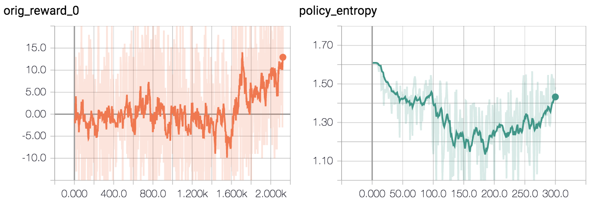
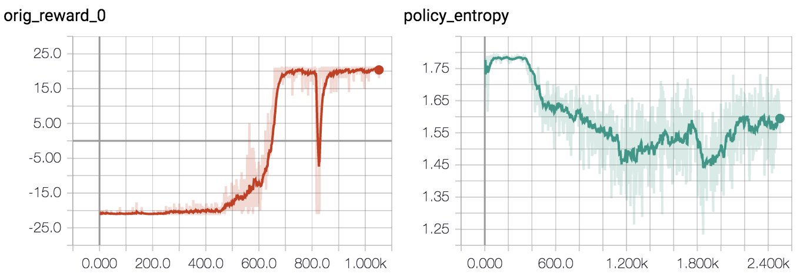

# Deep Reinforcement Learning from Human Preferences

Reproduction of OpenAI and DeepMind's [Deep Reinforcement Learning from Human
Preferences](https://blog.openai.com/deep-reinforcement-learning-from-human-preferences/),
based on the paper at <https://arxiv.org/pdf/1706.03741.pdf>.

## Results

The main milestones of this reproduction were:

* Training an agent to move the dot to the middle in a [simple environment](https://github.com/mrahtz/gym-moving-dot) using synthetic preferences.

* Training an agent to play Pong using synthetic preferences.

* Training an agent to stay alongside other cars in Enduro using *human* preferences.

## Usage

### Cloning

Note that some files in the repository are stored using [Git Large File
storage](https://git-lfs.github.com/). Please install Git LFS before cloning if
you want to use any of the data (checkpoints, preferences) stored in
[`runs`](runs).

### Python setup

To set up an isolated environment and install dependencies, install
[Pipenv](https://github.com/pypa/pipenv), then just run:

`$ pipenv install`

However, note that TensorFlow must be installed manually. Either:

`$ pipenv run pip install tensorflow`

or

`$ pipenv run pip install tensorflow-gpu`

depending on whether you have a GPU. (If you run into problems, try installing
TensorFlow 1.6.0, which was used for development.)

If you want to run tests, also run:

`$ pipenv install --dev`

Finally, before running any of the scripts, enter the environment with:

`$ pipenv shell`

### Running

All training is done using [`run.py`](run.py). Basic usage is:

`$ python3 run.py <mode> <environment>`

Supported environments are
[`MovingDotNoFrameskip-v0`](https://github.com/mrahtz/gym-moving-dot),
`PongNoFrameskip-v4`, and `EnduroNoFrameskip-v4`.

### Training with original rewards

To train using the original rewards from the environment rather than rewards
based on preferences, use the `train_policy_with_original_rewards` mode.

For example, to train Pong:

`$ python3 run.py train_policy_with_original_rewards PongNoFrameskip-v4 --n_envs 16 --million_timesteps 10`

### Training end-to-end with preferences

Use the `train_policy_with_preferences` mode.

For example, to train `MovingDotNoFrameskip-v0` using *synthetic* preferences:

`$ python3 run.py train_policy_with_preferences MovingDotNoFrameskip-v0 --synthetic_prefs --ent_coef 0.02 --million_timesteps 0.15`

On a machine with a GPU, this takes about an hour. TensorBoard logs (created in
a new directory in `runs/` automatically) should look something like:

To train Pong using *synthetic* preferences:

`$ python3 run.py train_policy_with_preferences PongNoFrameskip-v4 --synthetic_prefs --dropout 0.5 --n_envs 16 --million_timesteps 20`

On a 16-core machine without GPU, this takes about 13 hours. TensorBoard logs
should look something like:

To train Enduro (a modified version with a time limit so the weather doesn't change, which the paper notes can confuse the reward predictor) using *human* preferences:

`$ python3 run.py train_policy_with_preferences EnduroNoFrameskip-v4 --n_envs 16 --render_episodes`

You'll see two windows: a larger one showing a pair of examples of agent
behaviour, and another smaller window showing the last full episode that the
agent played (so you can see how qualitative behaviour is changing). Enter 'L'
in the terminal to indicate that you prefer the left example; 'R' to indicate
you prefer the right example; 'E' to indicate you prefer them both equally; and
just press enter if the two clips are incomparable.

On an 8-core machine with GPU, it takes about 2.5 hours to reproduce the video
above - about an hour to collect 500 preferences about behaviour from a random
policy, then half an hour to pretrain the reward predictor using those 500
preferences, then an hour to train the policy (while still collecting
preferences.)

The bottleneck is mainly labelling speed, so to train Enduro using saved human preferences:

`$ python3 run.py train_policy_with_preferences EnduroNoFrameskip-v4 --n_envs 16 --render_episodes --load_prefs_dir runs/enduro_8471d5d --n_initial_epochs 10`

This only takes about half an hour.

### Piece-by-piece runs

You can also run different parts of the training process separately, saving
their results for later use:
* Use the `gather_initial_prefs` mode to gather the initial 500 preferences
  used for pretraining the reward predictor. This saves preferences to
  `train_initial.pkl.gz` and `val_initial.pkl.gz` in the run directory.
* Use `pretrain_reward_predictor` to just pretrain the reward predictor (200
  epochs). Specify the run directory to load initial preferences from with
  `--load_prefs_dir`.
* Load a pretrained reward predictor using the `--load_reward_predictor_ckpt`
  argument when running in `train_policy_with_preferences` mode.

For example, to gather synthetic preferences for `MovingDotNoFrameskip-v0`,
saving to run directory `moving_dot-initial_prefs`:

`$ python run.py gather_initial_prefs MovingDotNoFrameskip-v0 --synthetic_prefs --run_name moving_dot-initial_prefs`

### Running on FloydHub

To run on [FloydHub](https://www.floydhub.com) (a cloud platform for
 running machine learning jobs), use something like:

`floyd run --follow --env tensorflow-1.5 --tensorboard
'bash floydhub_utils/floyd_wrapper.sh python run.py
--log_dir /output --synthetic_prefs
train_policy_with_preferences PongNoFrameskip-v4'`

### Running checkpoints

To run a trained policy checkpoint so you can see what the agent was doing, use
[`run_checkpoint.py`](run_checkpoint.py) Basic usage is:

`$ python3 run_checkpoint.py <environment> <policy checkpoint directory>`

For example:

* To run the agent trained for the moving dot environment:

`$ python3 run_checkpoint.py MovingDotNoFrameskip-v0 runs/moving-dot_45cb953/policy_checkpoints`

* To run the agent trained for Pong:

`$ python3 run_checkpoint.py PongNoFrameskip-v4 runs/pong_45cb953/policy_checkpoints`

* To run the agent trained for Enduro:

`$ python3 run_checkpoint.py EnduroNoFrameskip-v4 runs/enduro_8471d5d/policy_checkpoints`

## Architecture notes

There are three main components:
* The A2C workers ([`a2c/a2c/a2c.py`](a2c/a2c/a2c.py))
* The preference interface ([`pref_interface.py`](pref_interface.py))
* The reward predictor ([`reward_predictor.py`](reward_predictor.py))

### Data flow

The flow of data begins with the A2C workers, which generate video clips of the
agent trying things in the environment.

These video clips (referred to in the code as 'segments') are sent to the
preference interface. The preference interface shows pairs of video clips to
the user and asks through a command-line interface which clip of each pair
shows more of the kind of behaviour the user wants.

Preferences are sent to the reward predictor, which trains a deep neural
network to predict the each preference from the associated pair of video clips.
Preferences are predicted based on a comparison between two penultimate scalar
values in the network (one for each video clip) representing some measure of
how much the user likes each of the two clips in the pair.

That network can then be used to predict rewards for future video clips by
feeding the clip in, running a forward pass to calculate the "how much the user
likes this clip" value, then normalising the result to have zero mean and
constant variance across time.

This normalised value is then used directly as a reward signal to train the A2C
workers according to the preferences given by the user.

### Processes

All components run asynchronously in different subprocesses:
* A2C workers explore the environment and train the policy.
* The preference interface queries the user for preference.
* The reward predictor is trained using preferences given.

There are three tricky parts to this:
* Video clips must be sent from the A2C process to the process asking for
  preferences using a queue. Video clips are cheap, and the A2C process should
  never stop, so the A2C process only puts a clip onto the queue if the queue
  is empty, and otherwise drops the clips. The preference interface then just
  gets as many clips as it can from the queue in 0.5 seconds, in between asking
  about each pair of clips. (Pairs to show the user are selected from the clip
  database internal to the preference interface into which clips from the queue
  are stored.)
* Preferences must be sent from the preference interface to the reward
  predictor using a queue. Preferences should never be dropped, though, so the
  preference interface blocks until the preference can be added to the queue,
  and the reward predictor training process runs a background thread which
  constantly receives from the queue, storing preference in the reward
  predictor process's internal database.
* Both the A2C process and the reward predictor training process need to access
  the reward predictor network. This is done using Distributed TensorFlow: each
  process maintains its own copy of the network, and parameter updates from
  the reward predictor training process are automatically replicated to the A2C
  worker process's network.

All subprocesses are started and coordinated by [`run.py`](run.py).

## Changes to the paper's setup

It turned out to be possible to reach the milestones in the results section
above even without implementing a number of features described in the original
paper.

* For regularisation of the reward predictor network, the paper uses dropout,
  batchnorm and an adaptive L2 regularisation scheme. Here, we only use
  dropout. (Batchnorm is also supported. L2 regularisation is not implemented.)
* In the paper's setup, the rate at which preferences are requested is
  gradually reduced over time. We just ask for preferences at a constant rate.
* The paper selects video clips to show the user based on predicted reward
  uncertainty among an ensemble of reward predictors. Early experiments
  suggested a higher chance of successful training by just selecting video
  clips randomly (also noted by the paper in some situations), so we don't do
  any ensembling. (Ensembling code *is* implemented in
  [`reward_predictor.py`](reward_predictor.py), but we always operate with only
  a single-member ensemble, and [`pref_interface.py`](pref_interface.py) just
  chooses segments randomly.)
* The preference for each pair of video clips is calculated based on a softmax
  over the predicted latent reward values for each clip. In the paper,
  "Rather than applying a softmax directly...we assume there is a 10% chance
  that the human responds uniformly at random. Conceptually this adjustment is
  needed because human raters have a constant probability of making an error,
  which doesn’t decay to 0 as the difference in reward difference becomes
  extreme." I wasn't sure how to implement this - at least, I couldn't see a
  way to implement it that would actually affect the gradients - so we just do
  the softmax directly.

## Ideas for future work

If you want to hack on this project to learn some deep RL, here are some ideas
for extensions and things to investigate:

* **Better ways of selecting video clips for query**. As mentioned above and in
  the paper, it looks like using variance across ensemble members to select
  video clips to ask the user about sometimes _harms_ performance. Why is this?
  Is there some inherent reason that "Ask the user about the clips we're most
  uncertain about" is a bad heuristic (e.g. because then we focus too much on
  strange examples, and don't sample enough preferences for more common
  situations)? Or is it a problem with the uncertainty calculation? Do we get
  different results using [dropout-based
  uncertainty](https://arxiv.org/pdf/1506.02142.pdf), or by [ensembling but
  with shared parameters](https://arxiv.org/pdf/1602.04621.pdf)?
* **Domain randomisation for the reward predictor**. The paper notes that when
  training an agent to stay alongside other cars in Enduro, "the agent learns
  to stay almost exactly even with other moving cars for a substantial fraction
  of the episode, although it gets confused by changes in background". Could
  this be mitigated with [domain
  randomization](https://arxiv.org/pdf/1703.06907.pdf)? E.g. would randomly
  changing the colours of the frames encourage the reward predictor to be more
  invariant to changes in background?
* **Alternative reward predictor architectures**. When training Enduro, the
  user ends up giving enough preferences to cover pretty much the full range of
  possible car positions on the track. It's therefore unclear how much success
  in the kinds of simple environments we're playing with here is down to the
  interesting generalisation capabilities of deep neural networks, and how much
  it's just memorisation of examples. It could be interesting to explore much
  simpler architectures of reward predictor - for example, one which tries to
  establish a ranking of video clips directly from preferences (I'm not
  familiar with the literature, but e.g. [Efficient Ranking from Pairwise
  Comparisons](http://proceedings.mlr.press/v28/wauthier13.pdf)), then gives
  reward corresponding to the rank of the most similar video clip.
* **Automatic reward shaping**. Watching the graph of rewards predicted by the
  reward predictor (run [`run_checkpoint.py`](run_checkpoint.py) with a reward
  predictor checkpoint), it looks like the predicted rewards might be slightly
  better-shaped than the original rewards, even when trained with synthetic
  preferences based on the original rewards. Specifically, in Pong, it looks
  like there might be a small positive reward whenever the agent hits the ball.
  Could a reward predictor trained from synthetic preferences be used to
  automatically shape rewards for easier training?

## Code credits

A2C code in [`a2c`](a2c) is based on the implementation from [OpenAI's baselines](https://github.com/openai/baselines), commit [`f8663ea`](https://github.com/openai/baselines/commit/f8663ea).
