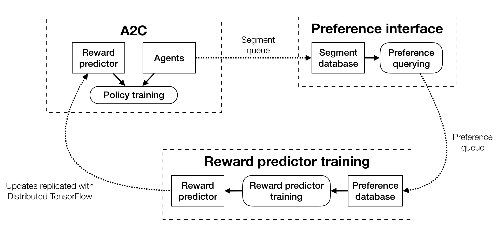

# Learning from Human Preferences

Reproduction of [Deep Reinforcement Learning from Human Preferences](https://arxiv.org/abs/1706.03741).

Code is yet to be cleaned up, so expect mess.

## Results

* Successful training in a simple moving dot environment using synthetic preferences.

* Successful training of Pong using synthetic preferences.

* Reproduction of Enduro behaviour shown in [OpenAI's blog post](https://blog.openai.com/deep-reinforcement-learning-from-human-preferences/) using human preferences.

## Running

### Python setup

To set up an isolated environment and install dependencies, install
[Pipenv](https://github.com/pypa/pipenv), then just run:

`pipenv install`

However, note that the correct version of TensorFlow must be installed
manually. Either:

`pipenv run pip install tensorflow==1.6.0`

or

`pipenv run pip install tensorflow-gpu==1.6.0`

depending on whether you have a GPU.

If you want to run tests, also run:

`pipenv install --dev`

Finally, before running any of the scripts, enter the environment with:

`pipenv shell`

### Runs with original rewards

To train Pong:

`python3 run.py train_policy_with_original_rewards PongNoFrameskip-v4 --n_envs 16 --million_timesteps 10`

### Piece-by-piece runs

First, save an initial set of 500 preferences:

`python run.py gather_initial_prefs MovingDotNoFrameskip-v0 --synthetic_prefs --run_name moving_dot-initial_prefs`

### End-to-end runs

To train a simple test environment, [gym-moving-dot](https://github.com/mrahtz/gym-moving-dot), with synthetic preferences:

`python run.py train_policy_with_preferences MovingDotNoFrameskip-v0 --synthetic_prefs --ent_coef 0.02 --million_timesteps 0.15`

To train Pong with synthetic preferences:

`python3 run.py train_policy_with_preferences PongNoFrameskip-v4 --synthetic_prefs --dropout 0.5 --n_envs 16 --million_timesteps 20`

### Running checkpoints

`python run_checkpoint.py MovingDotNoFrameskip-v0 runs/moving_dot-end_to_end-synthetic_prefs_bf708da/policy_checkpoints`

## Architecture notes

There are three main components:
* The A2C workers ([`a2c/a2c/a2c.py`](a2c/a2c/a2c.py))
* The preference interface ([`pref_interface.py`](pref_interface.py))
* The reward predictor ([`reward_predictor.py`](reward_predictor.py))

### Data flow

The flow of data begins with the A2C workers, which generate video clips of the
agent trying things in the environment.

These video clips (referred to in the code as 'segments') are sent to the
preference interface. The preference interface shows pairs of video clips to
the user and asks through a command-line interface which clip of each pair
shows more of the kind of behaviour the user wants.

Preferences are sent to the reward predictor, which trains a deep neural
network to predict the each preference from the associated pair of video clips.
Preferences are predicted based on a comparison between two penultimate scalar
values in the network (one for each video clip) representing some measure of
how much the user likes each of the two clips in the pair.

That network can then be used to predict rewards for future video clips by
feeding the clip in, running a forward pass to calculate the "how much the user
likes this clip" value, then normalising the result to have zero mean and
constant variance across time.

This normalised value is then used directly as a reward signal to train the A2C
workers according to the preferences given by the user.

### Processes

All components run asynchronously in different processes:
* A2C workers explore the environment and train the policy.
* The preference interface queries the user for preference.
* The reward predictor is trained using preferences given.

There are three tricky parts to this:
* Video clips must be sent from the A2C process to the process asking for
  preferences using a queue. Video clips are cheap, and the A2C process should
  never stop, so the A2C process only puts a clip onto the queue if the queue
  is empt, and otherwise drops the clips. The preference interface then just
  gets as many clips as it can from the queue in 0.5 seconds, in between asking
  about each pair of clips. (Pairs to show the user are selected from the clip
  database internal to the preference interface into which clips from the queue
  are stored.)
* Preferences must be sent from the preference interface to the reward
  predictor using a queue. Preferences should never be dropped, though, so the
  preference interface blocks until the preference can be added to the queue,
  and the reward predictor training process runs a background thread which
  constantantly receives from the queue, storing preference in the reward
  predictor process's internal database.
* Both the A2C process and the reward predictor training process need to access
  the reward predictor network. This is done using Distributed TensorFlow: each
  process maintains its own copy of the network, and parameter updates from
  the reward predictor training process are automatically replicated to the A2C
  worker process's network.

## Code credits

A2C code in [`a2c`](a2c) is based on the implementation from [OpenAI's baselines](https://github.com/openai/baselines), commit [`f8663ea`](https://github.com/openai/baselines/commit/f8663ea).
